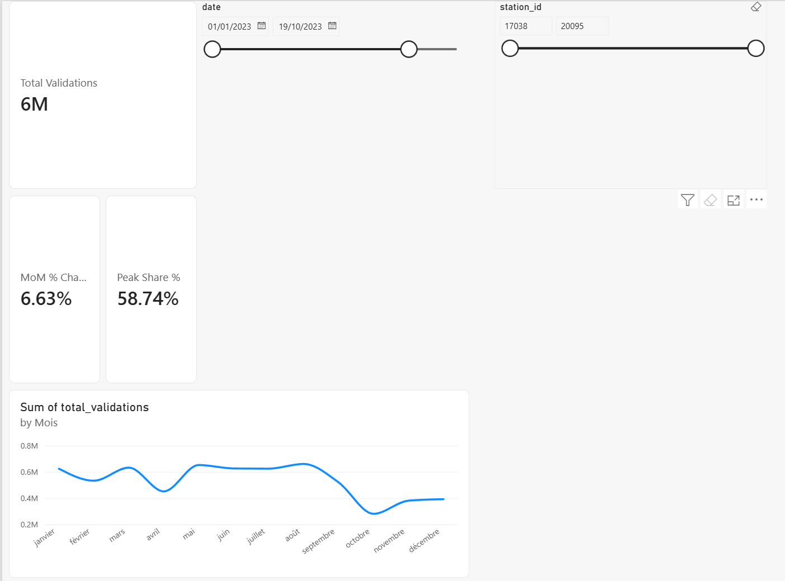

# Israel Open Data BI Dashboard

Interactive Power BI dashboard built from a real dataset published on Israel's official open data portal ([data.gov.il](https://data.gov.il)) — public transportation ridership, extracted, cleaned and modeled with SQL, then visualized with KPIs and trends tailored to a public-sector audience.

**Status:** Complete — SQL pipeline built and verified against real sample data, Power BI dashboard built (3 pages: Overview, Stations, Time patterns).

---

## EN — English

### What this is

Israel's Ministry of Transport publishes station-level public-transit ticket validation counts (a genuine ridership proxy — every Rav-Kav / ticket tap-in is counted) on data.gov.il. The raw file is exactly the kind of messy, undocumented government export a working analyst actually has to deal with: a **wide format** with one column per calendar day (`day_1` … `day_31`), a Hebrew time-band label that packs a time range and a peak/off-peak flag into a single string, and no field descriptions at all in the portal's own schema tab.

This project takes that raw file and:
1. Cleans and restructures it with SQL — unpivoting, date reconstruction, text parsing, deduplication (see `/sql`)
2. Models it into a star schema — one fact table, three dimensions (see `/docs/data_dictionary.md`)
3. Visualizes it in Power BI with KPIs and trends aimed at a transit-planning audience (see `/powerbi`)

### Where the data actually comes from

Nothing here is synthetic or hand-typed. Both source files were located and confirmed live on data.gov.il's own CKAN API before any code was written:

| | |
|---|---|
| **Fact table source** | "תיקופי מסלקה לתחנה" (Ticket Clearing-House Validations by Station) — Ministry of Transport and Road Safety |
| **Dimension source** | "תחנות תחבורה ציבורית" (Public Transport Stations) — Ministry of Transport and Road Safety |
| **Portal** | [data.gov.il](https://data.gov.il), datasets `tikufim_station_2022` and `bus_stops` |
| **License** | Israeli government open data (public sector information) |
| **Full dataset size (confirmed live)** | 2023 fact file alone: **1,957,511** raw wide-format rows, confirmed via a live `datastore_search` API call on 30/08/2026 |
| **Station geography size** | **34,166** stations nationwide, same API |

Exact resource IDs, direct CSV download links per year, and the API query examples used to confirm all of this are in `data/README.md`.

### Why only a sample is shipped in the repo, and where it came from

The full yearly fact file alone is ~1.96M rows before unpivoting — not something that belongs committed to GitHub. Instead, `data/sample/` ships a **real** slice pulled directly from data.gov.il's CKAN API (not invented, not downsampled from a bigger local file): 8 stations in Tel Aviv–Yafo (a mix of a railway station and regular bus stops), every month of the full 2023 calendar year — **556 raw rows**.

That sample is what the whole pipeline was actually run and verified against before anything was shipped:

| Step | Row count | What happened |
|---|---|---|
| `raw_validations` (as loaded) | 556 | untouched, as published |
| after unpivoting `day_1..day_31` → one row per day | 17,236 | wide → long |
| after dropping impossible day/month combos (e.g. `day_31` in a 30-day month) | 16,918 | real calendar dates only |
| after deduplication | 16,918 | 0 duplicates found in this sample |
| joined to the station dimension | 16,918 | **0** stations unmatched |
| final `dim_date` spine | 365 rows | one per day of 2023 |

The `/model` folder ships these exact outputs as CSVs, so anyone cloning this repo can open Power BI immediately without installing a database — see `powerbi/README.md`.

**To scale past the sample:** download the full yearly file(s) using the links in `data/README.md`, point `sql/01_staging.sql`'s `\copy` commands at them instead of the sample files, and re-run `sql/01` through `sql/05` — nothing else about the pipeline, the model, or the Power BI file changes.

### Dashboard preview

Three report pages, with synced date-range and station slicers so filtering on one page filters the others too.

**1. Overview** — KPI summary and the monthly trend across the full sample (8 Tel Aviv–Yafo stations, 2023).

- **Total Validations:** 6M across the sample period
- **MoM % Change:** 6.63%
- **Peak Share %:** 58.74% of validations happen during peak time bands
- Monthly trend line shows two dips (April, October) and a sustained peak from May through August

**2. Stations** — ranked comparison of the 8 sample stations, plus a geographic map (latitude/longitude) sized by validation volume.

All 8 stations cluster around central Tel Aviv–Yafo / Ramat Gan, consistent with the sample scope above.

**3. Time patterns** — split of validations by time band (donut) and by day of week (column chart, sorted Sunday → Saturday to match the Israeli work week).

- The **15:00–18:59 evening peak** band alone accounts for **46.47%** of all validations — the dominant commute pattern in this dataset
- Weekday volumes (Sunday–Thursday) are consistently higher than Friday/Saturday, reflecting Israel's Friday–Saturday weekend

### Repo structure

```
├── sql/                SQL pipeline — run 01 through 05 in order (PostgreSQL)
├── data/
│   ├── README.md        exact API resource IDs, download links per year, how to verify row counts yourself
│   └── sample/           the real 556-row sample described above (8 Tel Aviv stations, full 2023)
├── model/                clean, ready-to-import CSVs produced by actually running the SQL pipeline on the sample (star schema tables)
├── docs/
│   ├── overview.png, stations.png, time_patterns.png   dashboard screenshots (shown above)
│   ├── data_dictionary.md
│   └── methodology.md    every cleaning/modeling decision, and why (e.g. why a blank cell = 0, not missing)
└── powerbi/
    └── README.md         step-by-step Power BI build guide (beginner-level)
```

### Scope note

To keep this portfolio project real but manageable, the sample and the initial dashboard focus on **Tel Aviv–Yafo stations, full calendar year 2023** — the SQL pipeline itself is general and works unchanged against any year or region once you download the full files (see `data/README.md`).

---

## HE — עברית

### מה זה

משרד התחבורה מפרסם באתר data.gov.il נתוני תיקופים (חיובי כרטיס נסיעה) ברמת תחנה — קירוב אמין למספר הנוסעים בפועל בתחבורה הציבורית. הקובץ הגולמי הוא בדיוק סוג הנתונים ה"מבולגנים" והלא-מתועדים שאנליסט אמיתי נתקל בהם בעבודה: **פורמט רחב** עם עמודה נפרדת לכל יום בחודש (`day_1` עד `day_31`), תווית שעות בעברית שמאחדת טווח שעות ותיוג שיא/שפל למחרוזת אחת, וללא כל תיאור שדות בלשונית הסכימה של האתר עצמו.

הפרויקט לוקח את הקובץ הגולמי הזה ו:
1. מנקה ומבנה אותו מחדש באמצעות SQL — פריסה מרוחב לאורך (unpivot), בניית תאריך אמיתי, פענוח טקסט, הסרת כפילויות (ראו `/sql`)
2. בונה ממנו מודל אנליטי מסוג סכימת כוכב — טבלת עובדות אחת ושלוש טבלות ממדים (ראו `/docs/data_dictionary.md`)
3. מציג אותו ב-Power BI עם מדדי ביצוע (KPIs) ומגמות המותאמים לקהל של מתכנני תחבורה ציבורית (ראו `/powerbi`)

### מאיפה הנתונים באמת מגיעים

שום דבר כאן אינו סינתטי או מוקלד ידנית. שני קובצי המקור אותרו ואומתו ישירות מול ה-API של CKAN באתר data.gov.il לפני שנכתבה שורת קוד אחת:

| | |
|---|---|
| **מקור טבלת העובדות** | "תיקופי מסלקה לתחנה" — משרד התחבורה והבטיחות בדרכים |
| **מקור טבלת הממד** | "תחנות תחבורה ציבורית" — משרד התחבורה והבטיחות בדרכים |
| **האתר** | [data.gov.il](https://data.gov.il), מאגרים `tikufim_station_2022` ו-`bus_stops` |
| **רישיון** | נתוני ממשלה פתוחים (מידע ציבורי) |
| **גודל המאגר המלא (אומת ישירות)** | קובץ העובדות של 2023 בלבד: **1,957,511** שורות גולמיות בפורמט רחב, אומת דרך קריאת API חיה ל-`datastore_search` בתאריך 30/08/2026 |
| **גודל מאגר התחנות** | **34,166** תחנות ברחבי הארץ, אותו API |

מזהי המשאבים המדויקים, קישורי הורדה ישירים לכל שנה, ודוגמאות שאילתות ה-API ששימשו לאימות כל זה, נמצאים ב-`data/README.md`.

### למה רק מדגם נמצא בריפוזיטורי, ומאיפה הוא הגיע

קובץ העובדות השנתי המלא לבדו מכיל כ-1.96 מיליון שורות עוד לפני פריסה מרוחב לאורך — לא משהו ש"שייך" ל-GitHub. במקום זאת, `data/sample/` מכיל פלח **אמיתי** שנמשך ישירות מה-API של CKAN באתר (לא הומצא, ולא נדגם מקובץ מקומי גדול יותר): 8 תחנות בתל אביב-יפו (שילוב של תחנת רכבת ותחנות אוטובוס רגילות), כל חודש בשנת 2023 המלאה — **556 שורות גולמיות**.

זהו בדיוק המדגם שכל הצנרת הורצה ואומתה מולו לפני שמשהו שוגר:

| שלב | מספר שורות | מה קרה |
|---|---|---|
| `raw_validations` (כפי שנטען) | 556 | ללא שינוי, כפי שפורסם |
| אחרי פריסת `day_1..day_31` לשורה אחת ליום | 17,236 | רוחב → אורך |
| אחרי הסרת צירופי יום/חודש בלתי אפשריים (למשל `day_31` בחודש בן 30 יום) | 16,918 | תאריכים קלנדריים אמיתיים בלבד |
| אחרי הסרת כפילויות | 16,918 | 0 כפילויות נמצאו במדגם זה |
| אחרי חיבור לממד התחנות | 16,918 | **0** תחנות ללא התאמה |
| שדרת `dim_date` הסופית | 365 שורות | אחת לכל יום ב-2023 |

התיקייה `/model` מכילה את הפלטים המדויקים הללו כקובצי CSV, כך שכל מי ששוכפל את הריפו יכול לפתוח Power BI מיד בלי להתקין מסד נתונים — ראו `powerbi/README.md`.

**להרחבה מעבר למדגם:** הורידו את הקבצים השנתיים המלאים בעזרת הקישורים ב-`data/README.md`, כוונו את פקודות ה-`\copy` בקובץ `sql/01_staging.sql` אליהם במקום לקובצי המדגם, והריצו מחדש את `sql/01` עד `sql/05` — שום דבר אחר בצנרת, במודל או בקובץ ה-Power BI לא צריך להשתנות.

### תצוגה מקדימה של הדשבורד

שלושה עמודי דוח, עם מסנני תאריך ותחנה מסונכרנים, כך שסינון בעמוד אחד משפיע גם על השאר.

**1. סקירה כללית** — סיכום מדדי KPI ומגמה חודשית לאורך כל תקופת המדגם (8 תחנות בתל אביב-יפו, 2023).


- **סה"כ תיקופים:** 6M לאורך תקופת המדגם
- **שינוי חודשי (MoM):** 6.63%
- **נתח שיא:** 58.74% מהתיקופים מתרחשים בשעות השיא
- קו המגמה החודשי מראה שתי ירידות (אפריל, אוקטובר) ושיא מתמשך ממאי עד אוגוסט

**2. תחנות** — השוואה מדורגת בין 8 תחנות המדגם, לצד מפה גיאוגרפית (קו רוחב/אורך) בגודל יחסי לנפח התיקופים.


כל 8 התחנות מרוכזות סביב מרכז תל אביב-יפו / רמת גן, בהתאם להיקף המדגם שתואר למעלה.

**3. דפוסי זמן** — פילוח תיקופים לפי רצועת שעות (דונאט) ולפי יום בשבוע (תרשים עמודות, ממוין ראשון-שבת בהתאם לשבוע העבודה הישראלי).


- רצועת **שיא הערב (15:00-18:59)** לבדה מהווה **46.47%** מכלל התיקופים — דפוס הנסיעה הדומיננטי במאגר זה
- נפחי ימי החול (ראשון-חמישי) גבוהים באופן עקבי מיום שישי/שבת, בהתאם לסוף השבוע הישראלי (שישי-שבת)

### מבנה הריפוזיטורי

```
├── sql/                צנרת SQL — הריצו 01 עד 05 בסדר (PostgreSQL)
├── data/
│   ├── README.md        מזהי משאבים מדויקים, קישורי הורדה לכל שנה, איך לאמת מספרי שורות בעצמכם
│   └── sample/           מדגם 556 השורות האמיתי שתואר למעלה (8 תחנות בתל אביב, שנת 2023 מלאה)
├── model/                קובצי CSV נקיים ומוכנים לייבוא, שהופקו מהרצה בפועל של צנרת ה-SQL על המדגם (טבלאות סכימת כוכב)
├── docs/
│   ├── overview.png, stations.png, time_patterns.png   צילומי מסך של הדשבורד (מוצגים למעלה)
│   ├── data_dictionary.md
│   └── methodology.md    כל החלטת ניקוי/מידול, ולמה (למשל למה תא ריק = אפס, לא חסר)
└── powerbi/
    └── README.md         מדריך בנייה שלב-אחר-שלב ל-Power BI (רמת מתחילים)
```

### הערת היקף

כדי לשמור על פרויקט פורטפוליו אמיתי אך בר-ניהול, המדגם והדשבורד הראשוני מתמקדים ב**תחנות תל אביב-יפו, שנת 2023 מלאה** — צנרת ה-SQL עצמה כללית ועובדת ללא שינוי על כל שנה או אזור אחר לאחר הורדת הקבצים המלאים (ראו `data/README.md`).
